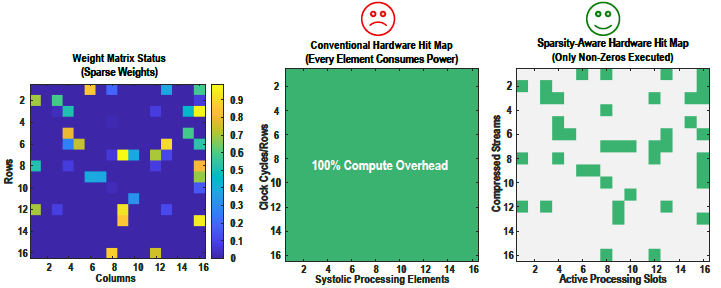
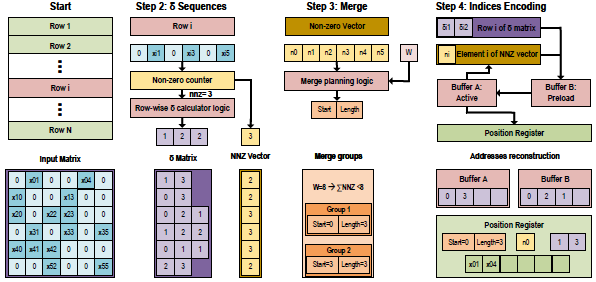
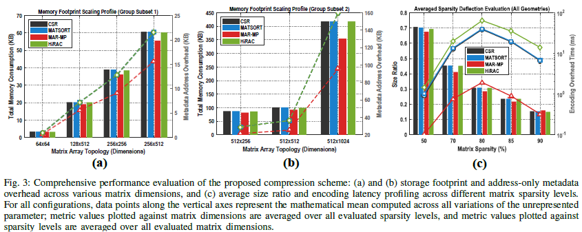

# MAR-MP: Memory-Addressed Register with Merge Planning

> A hardware-software co-design scheme for compressed address encoding in DNN sparse matrix acceleration.

[](.)
[](.)
[](.)

---

## Overview

Sparse weight matrices produced by modern DNN pruning (70–98% sparsity) offer major efficiency gains — but conventional parallel hardware like systolic arrays process every element uniformly, wasting compute on zeros.


*Fig. 1: A sparse weight matrix mapped to conventional hardware results in 100% compute overhead. Sparsity-aware hardware executes only non-zero elements, dramatically reducing active processing slots.*

MAR-MP addresses two critical bottlenecks in deploying sparse matrix acceleration for DNN inference on edge hardware:

1. **Address storage overhead** — conventional methods (CSR, MATSORT) store full-width absolute column indices for every non-zero element, which is impractical for memory-constrained edge devices.
2. **Runtime merge latency** — iterative row-merge decisions that scale poorly with matrix size introduce significant runtime branching overhead.

MAR-MP resolves both through two complementary techniques:

- **Delta encoding** — replaces absolute column indices with compact gap sequences between consecutive non-zero positions, reducing per-element address bit-width to 3–4 bits for typical pruned networks.
- **Offline merge planning** — precomputes the full row-merging schedule as a fixed lookup table, eliminating all runtime conditional branching during inference.

Together, these reduce address metadata storage by up to **40%**, overall compressed size by up to **15%**, and encoding time by up to **24×** vs. MATSORT — with zero accuracy loss.

---

## How It Works


*Fig. 2: The MAR-MP algorithm flow across four steps — non-zero identification, delta and NNZ vector encoding, offline merge planning, and hardware index reconstruction via double-buffered FIFO and position register.*

The MAR-MP pipeline consists of four steps:

```
Input Matrix
     │
     ▼
1. Identify Non-Zero Elements
   └─ Record column positions in row-major order
     │
     ▼
2. Delta & NNZ Vector Encoding
   └─ Compute gaps between consecutive non-zero positions
   └─ Record per-row non-zero counts (NNZ vector)
     │
     ▼
3. Offline Merge Planning
   └─ Sort rows by density (descending)
   └─ Greedily pack rows into groups where ΣNNZ ≤ W
   └─ Output fixed (start, length) schedule — no runtime branching
     │
     ▼
4. Indices Encoding at Runtime
   └─ Double-buffered FIFO streams delta sequences
   └─ Position register accumulates deltas per clock cycle
   └─ Count register tracks row boundaries via NNZ vector
   └─ Reconstructed addresses forwarded directly to MAC unit
```

### Delta Encoding Example

For a row with non-zeros at columns `[2, 5, 7]`:
- Stored deltas: `[2, 3, 2]` instead of `[2, 5, 7]`
- At runtime, a single position register accumulates: `0 → 2 → 5 → 7`

### Merge Planning Example

Three rows A, B, C with NNZ = `[3, 2, 3]` and hardware width W = 8:
- 3 + 2 + 3 = 8 ≤ W → all placed in one group: `(start=0, length=3)`
- Hardware follows this schedule directly — no per-row condition evaluation

---

## Results


*Fig. 3: (a) and (b) Storage footprint and address-only metadata overhead across various matrix dimensions. (c) Average size ratio and encoding latency across different sparsity levels. MAR-MP consistently achieves the lowest memory footprint and fastest encoding time.*

### Storage & Speed Summary

| Algorithm  | Avg. Run Time Improvement | Avg. Size Improvement |
|------------|:-------------------------:|:---------------------:|
| CSR        | ×1                        | ×1                    |
| HiRAC      | ×0.67                     | ×1.01                 |
| MATSORT    | ×1.02                     | ×1.04                 |
| **MAR-MP** | **×18.27**                | **×1.12**             |

*Evaluated at 75% sparsity across variant matrix sizes.*

### Highlights

- Address byte savings vs. MATSORT: up to **40%** (avg. **23.9%**)
- Encoding time reduction: **9.2×–24.3×** vs. MATSORT (mean **28.7×**)
- Largest matrix tested (512×1024, 75% sparsity): **5.13 ms** vs. 95.58 ms (MATSORT)
- Smallest matrix tested (64×64, 50% sparsity): **0.1 ms** vs. 1.01 ms (MATSORT)
- All outputs verified **lossless** across all 11 configurations

> MAR-MP achieves the best savings at moderate sparsity (65–80%), where non-zeros are densely clustered and deltas are small. At extreme sparsity (90%+), merge schedule overhead can marginally exceed the delta savings — an expected and documented trade-off.

---

## Comparison with Prior Work

| Method         | Conflict-Free | No Residual Zeros | Compact Address | Offline Merge Planning |
|----------------|:---:|:---:|:---:|:---:|
| Column Combine | ✗  | ✓ | ✓ | ✗ |
| HIRAC/SorPack  | ✓  | ✓ | ✗ | ✗ |
| SCNN           | ✗  | ✗ | ✗ | ✗ |
| STPU           | ✓  | ✓ | ✗ | Partial |
| MATSORT        | ✓  | ✓ | ✗ | ✗ |
| dCSR           | —  | — | ✓ | ✗ |
| **MAR-MP**     | ✓  | ✓ | ✓ | ✓ |

---

## Installation

```bash
git clone https://github.com/your-org/mar-mp.git
cd mar-mp
pip install -r requirements.txt
```

**Requirements:** Python 3.8+, NumPy, SciPy

---

## Usage

```python
from mar_mp import delta_encode, plan_merge_groups, restore_and_mac

# Compress a sparse matrix
delta_seqs, nnz_vector = delta_encode(sparse_matrix)

# Precompute merge schedule (offline, once per model layer)
merge_groups = plan_merge_groups(nnz_vector, hardware_width=W)

# Reconstruct addresses and perform MAC at inference time
results = restore_and_mac(sparse_matrix, delta_seqs, nnz_vector, merge_groups, input_vector)
```

See `examples/` for full end-to-end demos across different matrix sizes and sparsity levels.

---

## Evaluation

Experiments were run on an **AMD Ryzen 5 5600X CPU** across 11 matrix configurations spanning sizes from 64×64 to 512×1024 and sparsity levels from 50% to 90%. Each result is averaged over **200 trials** with randomly generated sparse matrices.

To reproduce results:

```bash
python evaluate.py --configs all --trials 200
```

Metrics reported:
- **Size ratio** — compressed size ÷ original uncompressed size
- **Address metadata bytes** — positional metadata storage only (excluding values)
- **Encoding time (ms)** — software compression processing time
- **MAR-MP address savings** — % reduction vs. MATSORT

---

## Citation

If you use MAR-MP in your research, please cite:

```bibtex
@inproceedings{cho2025marmp,
  title     = {MAR-MP: A Memory-Addressed Register Scheme with Merge Planning
               for Compressed Address Encoding for DNN Applications},
  author    = {Cho, Sungkyun and Ahrar, Alireza and Amirsoleimani, Amirali},
  booktitle = {Proceedings of ...},
  year      = {2025}
}
```

---

## Authors

- **Sungkyun Cho** — Dept. of Electrical and Computer Engineering, McMaster University, Hamilton, Canada
- **Alireza Ahrar** — Dept. of Electrical Engineering and Computer Science, York University, Toronto, Canada
- **Amirali Amirsoleimani** — Dept. of Electrical Engineering and Computer Science, York University, Toronto, Canada

---

## License

This project is licensed under the MIT License. See [LICENSE](LICENSE) for details.
